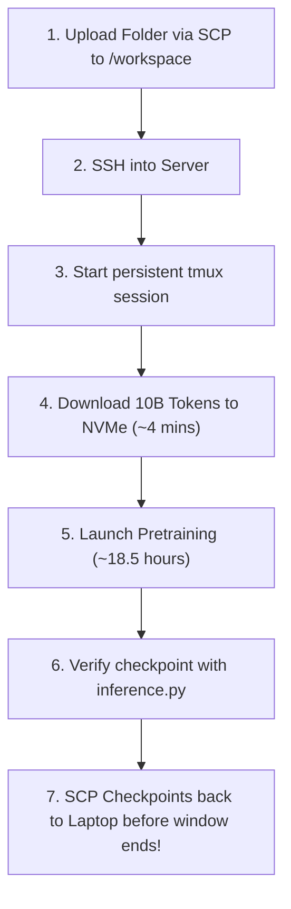

# Pramana SLM++ Bootcamp: Qwen2.5-0.5B Pretraining Runbook (10B Tokens on H100)

Complete, battle-tested pretraining guide for **Qwen2.5-0.5B (~490M parameters)** on **10 Billion tokens** of **FineWeb-Edu (`sample-10BT`)**, optimized for the **Pramana SLM++ Brev GPU Server** (`global.prd.ga.run.brev.nvidia.com`).

Reference Lecture & Tutorial: [Special Session 01: Open Language Model](https://www.youtube.com/watch?v=MktU2HJmJR4)

---

## 1. Server Environment & Architecture

### Server Specifications

* **Hardware**: Dedicated NVIDIA H100 / H200 GPU server (80GB+ HBM3).
* **Software**: Python 3 with PyTorch 2.8+cu128 (CUDA enabled).
* **OpenLanguageModel (OLM)**: **Pre-installed** in the server environment (`import olm` works out-of-the-box).
* **Workspace**: `/workspace` is your private, dedicated folder. When you log in via SSH, you start in `/workspace` automatically.
* **Built-in Tools**: `git`, `tmux`, `pip`, standard Linux editors, and libraries.
* **Storage**: High-speed local NVMe storage mounted at `/workspace`.

### Architecture & Compute Budget

* **Model**: [`Qwen2_5_0_5B`](file:///d:/Plaksha_sem7/Course_work/SLM/openlanguagemodel/src/olm/models/alibaba/qwen2.py#L165)
  * Parameters: **490 Million** (`embed_dim=896`, `layers=24`, `heads=14`, `kv_heads=2`, `intermediate_size=4864`, `vocab_size=151936`).
  * Features: Grouped-Query Attention (GQA), SwiGLU, RMSNorm with QKV bias, RoPE ($\theta = 1,000,000$).
* **Dataset**: `HuggingFaceFW/fineweb-edu` (`subset="sample-10BT"`, ~35 GB parquet files on local NVMe).
* **Throughput**: ~145,000 to 155,000 tokens/sec.
* **Effective Batch**: $32 \text{ batch} \times 4 \text{ accum} \times 1024 \text{ seq} = 131,072 \text{ tokens/step}$.
* **Total Training Steps**: **76,293 steps** ($\approx 10\text{ Billion tokens}$).
* **Estimated Runtime**: **~18.0 to 18.5 hours** (leaving ~1.5 hours of buffer within your 20-hour window).

---

## 2. Quick Reference: Step-by-Step Server Runbook



---

### Step 1: Upload This Folder to the Server (From Your Laptop)

Open **Terminal** (macOS/Linux) or **PowerShell** (Windows) on your laptop and run:

```bash
# Replace TEAM_NAME with your assigned team (e.g., team01)
scp -P 21510 -r ./examples/qwen2_5-0_5b-fineweb-edu-10b TEAM_NAME@global.prd.ga.run.brev.nvidia.com:./
```

> **Note**: In Brev's configuration, the remote path `:./` automatically points to `/workspace`. The folder will be uploaded to `/workspace/qwen2_5-0_5b-fineweb-edu-10b`.

---

### Step 2: Connect to the GPU Server via SSH

From your laptop terminal:

```bash
ssh -p 21510 TEAM_NAME@global.prd.ga.run.brev.nvidia.com
```

When prompted, enter the password sent to your team POC. You will land in `/workspace`.

Navigate to the uploaded project directory:

```bash
cd /workspace/qwen2_5-0_5b-fineweb-edu-10b
ls -la
```

---

### Step 3: Start a Persistent `tmux` Session

> [!IMPORTANT]
> **Always run training inside `tmux`!** If your Wi-Fi disconnects or your laptop goes to sleep, a standard SSH process will be killed. Inside `tmux`, the training will keep running uninterrupted on the H100.

1. **Start the session**:

   ```bash
   tmux new -s pretrain
   ```
2. **Useful `tmux` shortcuts**:

   * **Detach (leave training running in background)**: Press `Ctrl + B`, release, then press `D`.
   * **Re-attach (check back later)**: `tmux attach -t pretrain`
   * **List sessions**: `tmux ls`

---

### Step 4: Download the 10B Dataset to Local NVMe (~3 to 5 mins)

Run `prepare_data.py` to download the ~35 GB of parquet files directly to the server's local NVMe:

```bash
python prepare_data.py --target_dir ./data/fineweb_edu_10bt
```

* Because datacenter networking is extremely fast (1–10 Gbps), this completes in **~3 to 5 minutes**.
* Once finished, you will see:
  ```
  Found 100 parquet files (35.24 GB total).
  [Verification Passed] Data preparation complete!
  ```
* Reading directly from local NVMe guarantees **maximum H100 utilization** and **zero network dropouts** during the 18.5-hour training run.

---

### Step 5: Launch Pretraining

Start training with unbuffered logging (`-u`):

```bash
python -u train.py --config config.yaml
```

The script will display:

```
================================================================================
Qwen2.5-0.5B Pretraining on FineWeb-Edu 10B Tokens
================================================================================
Device:            cuda
GPU Name:          NVIDIA H100 80GB HBM3
VRAM Available:    79.20 GB
Context Length:    1024
Batch Size:        32 (per device)
Grad Accum Steps:  4
Effective Batch:   131,072 tokens per optimizer update
Target Max Steps:  76,293 steps (~10B tokens)
================================================================================
```

#### Monitoring Training

Open a second terminal or split your `tmux` pane:

* **Monitor GPU utilization & temperature**:

  ```bash
  watch -n 1 nvidia-smi
  ```

  *(Target: GPU-Util should be 90%–100%, VRAM ~18–25 GB out of 80 GB).*
* **Monitor training loss & tokens/sec**:

  ```bash
  tail -f logs/train.log
  ```

---

### Step 6: Test Generation from the Checkpoint

Checkpoints are saved automatically to `./checkpoints/`:

* `checkpoints/step_*.pt` (saved every 2,500 steps)
* `checkpoints/qwen_0_5b_final.pt`

Test your trained model with `inference.py`:

```bash
# 1. Test with a sample prompt
python inference.py --checkpoint checkpoints/qwen_0_5b_final.pt --prompt "The fundamental rules of artificial intelligence safety are"

# 2. Interactive chat mode
python inference.py --checkpoint checkpoints/qwen_0_5b_final.pt --interactive
```

---

### Step 7: How to Resume Training (If Interrupted)

If training is ever stopped or the node restarts, resume seamlessly:

```bash
python -u train.py --config config.yaml --resume checkpoints/step_25000.pt
```

The script will load the weights, optimizer state, and scaler state, and automatically skip the already processed dataset samples to resume right where it left off.

---

### Step 8: CRITICAL — Copy Results to Your Laptop Before Window Closes

> [!CAUTION]
> **Warning**: When your team's scheduled server window expires, the `/workspace` folder on the Brev server is **wiped automatically**! Make sure to copy your model checkpoints back to your laptop before the window closes.

From your **local laptop terminal**:

```bash
# Download the entire checkpoints folder to your laptop
scp -P 21510 -r TEAM_NAME@global.prd.ga.run.brev.nvidia.com:./qwen2_5-0_5b-fineweb-edu-10b/checkpoints ./local_checkpoints

# Download logs and training metrics
scp -P 21510 -r TEAM_NAME@global.prd.ga.run.brev.nvidia.com:./qwen2_5-0_5b-fineweb-edu-10b/logs ./local_logs
```

---

## File Structure

```
qwen2_5-0_5b-fineweb-edu-10b/
├── config.yaml          # Pretraining hyperparameters for H100
├── prepare_data.py      # High-speed parallel download of 10B parquet files to NVMe
├── train.py             # Main pretraining script with checkpoints & resumption
├── inference.py         # Checkpoint verification & text generation sampler
├── README.md            # Complete operational runbook
├── data/                # Downloaded FineWeb-Edu 10B parquet files (~35 GB)
├── checkpoints/         # Model checkpoints (step_*.pt, qwen_0_5b_final.pt)
└── logs/                # Text logs and JSON lines metrics
```
